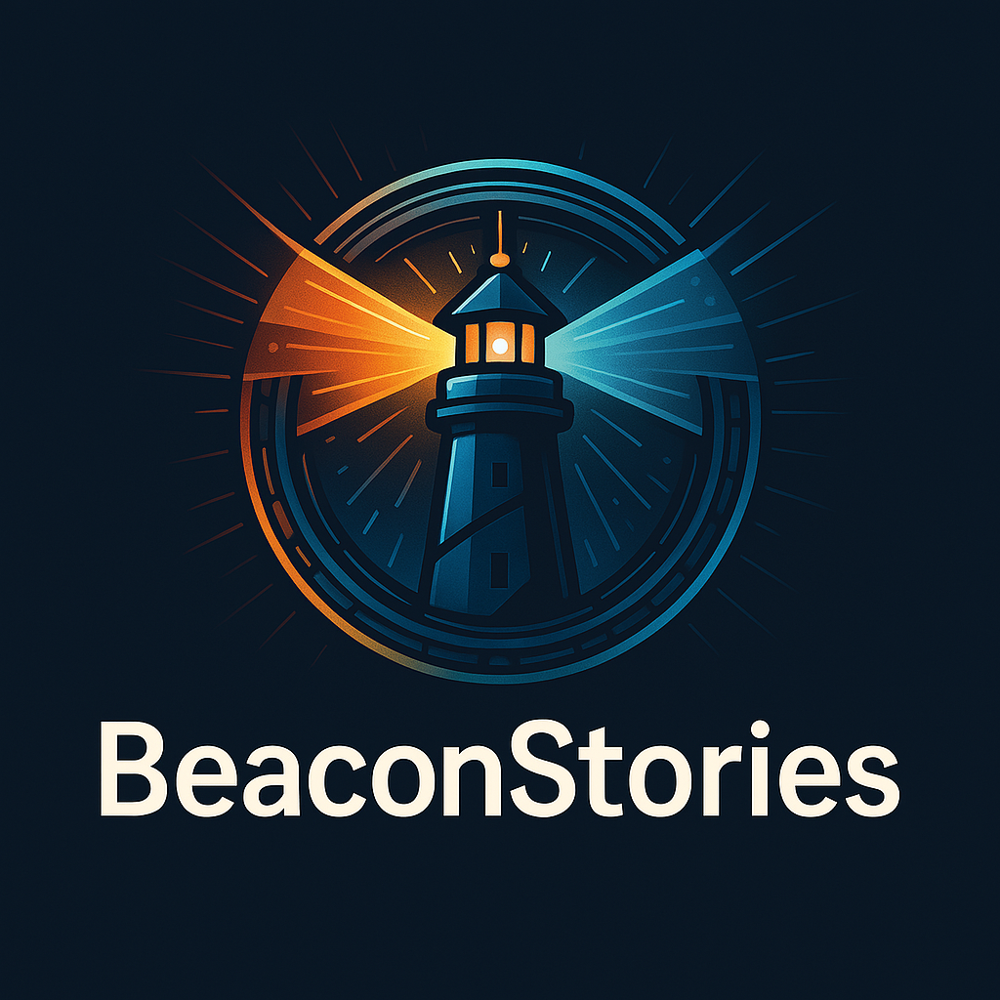

# BeaconStories

Welcome to **BeaconStories**, a project built with **HTML** and **CSS** to create engaging and visually appealing web experiences.

 <!-- Replace # with a link to your project banner image -->

---

## About

**BeaconStories** is a web-based project designed to [insert purpose of your project here]. This repository contains all the code and assets needed to build and deploy the application.

### Technologies Used

- **HTML** (52%): The backbone of the project structure.
- **CSS** (48%): Styling and layout design for a visually appealing interface.

---

## Features

- [Insert key feature #1]
- [Insert key feature #2]
- [Insert key feature #3]

---

## Getting Started

### Prerequisites

To work with this project, you’ll need:

- A modern web browser (e.g., Chrome, Firefox, Edge)
- A text editor (e.g., VSCode, Sublime Text)

### Website
We use a Github Page in the description.
